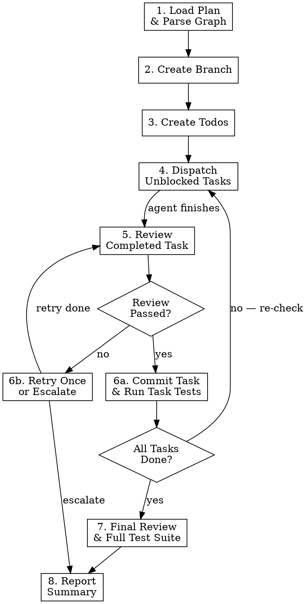

# Execute

Dispatches a plan's task dependency graph as parallel sub-agents, reviews each task, commits per task, runs tests, performs a final whole-project review, and reports results.

**Announce at start:** "Using the execute skill to implement the plan."

<HARD-GATE>
1. NEVER skip code review for any task. Every task completed by code-writer MUST be reviewed by code-review-inspector before being marked complete.
2. NEVER review code yourself (the orchestrator). ALWAYS dispatch a code-review-inspector background agent. The orchestrator's job is to dispatch, wait, and act on results — never to review code inline.
3. NEVER dispatch a task whose blockers are not ALL completed. Check the dependency graph before every dispatch.
4. NEVER mark a task complete if its review failed and retry was not attempted.
5. NEVER let sub-agents run git commands. Only the orchestrator touches git.
6. NEVER commit code that failed review.
</HARD-GATE>

## Process



## Phase 1: Load Plan & Parse Dependency Graph

1. Read the plan file (e.g. `docs/plans/YYYY-MM-DD-<topic>.md`).
2. Parse ALL sections — not just the Tasks table. Extract:
   - **Goal & Approach** — for providing plan context to agents
   - **Scope** — for boundary enforcement during review
   - **Acceptance Criteria** — for review verification
   - **Data Model** — for code-writer reference
   - **API Contracts** — for code-writer reference
   - **Error Handling** — for code-writer and reviewer reference
   - **Testing Strategy** — for knowing what tests to run and the run command
   - **Tasks table** — `ID`, `Task`, `Blocked By`, `Risk`, `Files`, `Description`
   - **Notes for Implementer** — for code-writer context
3. Build an in-memory dependency graph: map each task ID to its list of blocker IDs.
4. Validate: every blocker ID must exist in the table. If not, stop and ask the user.

## Phase 2: Create Feature Branch (with Crash Recovery)

**Check for an existing branch first** — this enables resuming after a crash:

```bash
# Check if the feature branch already exists
git branch --list "feat/<topic>"
```

**If the branch exists (resuming):**
1. Switch to it: `git checkout feat/<topic>`
2. Scan the git log for already-committed tasks:
   ```bash
   git log --oneline --grep="^feat\|^fix\|^test\|^refactor" feat/<topic> --not main
   ```
3. Match commit messages against task IDs (commits follow the pattern `feat(scope): T<id> — <name>`)
4. Mark matched tasks as `completed` in the todo list — skip them during dispatch
5. **Report to user:** "Resuming on branch `feat/<topic>`. Tasks already committed: T1, T3. Remaining: T2, T4, T5."

**If the branch does not exist (fresh start):**
1. Create it: `git checkout -b feat/<topic>`
2. Derive `<topic>` from the plan's feature name — lowercase, hyphenated, no dates. Examples:
   - Plan: "User Authentication" → `feat/user-auth`
   - Plan: "Dashboard Redesign" → `feat/dashboard-redesign`
   - Plan: "Add CSV Export" → `feat/csv-export`
3. **Report to user:** "Created branch `feat/<topic>` from `<base-branch>`."

## Phase 3: Create Todos

For each task in the table, call `TaskCreate` with:
- **subject**: `T<id>: <Task name>`
- **description**: The task's `Description` from the plan, plus its `Files` list
- **activeForm**: `Implementing T<id>`

Set up `addBlockedBy` relationships matching the plan's dependency graph.

## Phase 4: Max-Parallelism Dispatch Loop

This is the core algorithm. Repeat until all tasks are complete or a failure escalates:

```
1. Get all tasks via TaskList
2. For each task with status "pending":
   a. Check if ALL tasks in its "Blocked By" list have status "completed"
   b. If yes → set status to "in_progress" and dispatch code-writer (see below)
3. Wait for any agent to finish
4. When an agent finishes → go to Phase 5 (review)
5. After review resolves → loop back to step 1 (new tasks may be unblocked)
```

Do NOT wait for a full "wave" to finish. Dispatch every unblocked task immediately.

### Model Selection Rules

| Agent | Model | Why |
|---|---|---|
| **code-writer** (high/med risk) | `opus` | Complex logic needs the strongest model |
| **code-writer** (low risk) | `sonnet` | Simple tasks — faster and cheaper |
| **code-review-inspector** (per-task) | `opus` always | Reviews are the safety gate — always use strongest |
| **code-review-inspector** (final review) | `opus` always | Last checkpoint before shipping — never cut corners |

### Dispatching code-writer

Use the Agent tool with `subagent_type: "code-writer"`. Select the model based on the task's **Risk** level:

| Risk | Model |
|---|---|
| `high` | `opus` |
| `med` | `opus` |
| `low` | `sonnet` |

The prompt MUST include:

1. **Task details** — ID, name, files, full description
2. **Relevant spec sections** — include Data Model, API Contracts, Error Handling sections from the plan if they're relevant to this task. Don't dump the entire plan — include only what this task needs.
3. **Acceptance criteria** — list which acceptance criteria this task satisfies (from the task description's "Satisfies AC X" references)
4. **Dependency context** — what blocker tasks produced (so the agent knows what already exists)
5. **Git prohibition** — explicitly tell the agent NOT to run any git commands

```
Agent tool call:
  subagent_type: "code-writer"
  model: "opus"              # ← based on task Risk level (high/med → opus, low → sonnet)
  prompt: |
    Implement task T1 from the plan.

    **Task:** Create DB schema
    **Risk:** high
    **Files:** src/db/schema.ts
    **Description:** Create the users and sessions tables using Drizzle ORM.
    Define the users table with columns: id (uuid, pk), email (text, unique),
    password_hash (text), created_at (timestamp). Define the sessions table
    with columns: id (uuid, pk), user_id (uuid, fk to users), token (text),
    expires_at (timestamp).
    **Satisfies:** AC 1 ("Users table exists with correct columns"), AC 2 ("Sessions table has FK to users")

    **Data Model from spec:**
    [paste relevant Data Model section]

    **Error Handling from spec:**
    [paste relevant Error Handling section if applicable]

    **Plan context:** We are building an auth module. The API routes (T2)
    and tests (T5) depend on this schema being correct.

    **IMPORTANT:** Do NOT run any git commands (git add, git commit, git push, etc.).
    The orchestrator handles all git operations.
```

### Progress Updates

After dispatching each batch of unblocked tasks, report to the user:

> "Dispatched T1, T3 (parallel). T2, T4, T5 waiting on blockers."

After each task completes its review-commit cycle, report:

> "T1 complete and committed. T2 now unblocked — dispatching."

Keep updates short. One line per event.

## Phase 5: Review Completed Task

When code-writer finishes a task, **immediately dispatch code-review-inspector as a background agent**.

**CRITICAL: ALWAYS use `run_in_background: true`.** The orchestrator must NEVER review code itself. Every review MUST be a background code-review-inspector agent. This saves orchestrator tokens and enables parallel reviews while other code-writers are still running.

**Workflow:**
1. Dispatch review as a background agent (`run_in_background: true`)
2. While the review runs, continue dispatching any other unblocked code-writer tasks
3. When the review agent completes (you'll be notified), read its result and proceed to Phase 6

The review prompt MUST include:
1. **Task details** — same as what code-writer received
2. **Acceptance criteria** — the specific ACs this task should satisfy
3. **Plan's error handling section** — so the reviewer can check error cases
4. **Scope boundaries** — so the reviewer can flag out-of-scope additions

```
Agent tool call:
  subagent_type: "code-review-inspector"
  model: "opus"
  run_in_background: true      # ← ALWAYS run reviews in background
  prompt: |
    Review the implementation of task T1 from the plan.

    **Task:** Create DB schema
    **Files to review:** src/db/schema.ts
    **Plan description:** [full description from plan]
    **Acceptance criteria to verify:**
    - AC 1: "Users table exists with correct columns"
    - AC 2: "Sessions table has FK to users"

    **Error handling requirements from spec:**
    [paste error handling section]

    **Scope — out of scope items (should NOT be implemented):**
    [paste out of scope list]

    **What to verify:**
    1. Implementation matches the plan description
    2. Acceptance criteria are satisfied
    3. Error handling matches the spec
    4. No out-of-scope additions
    5. No bugs, security issues, or bad patterns
    6. Code quality and maintainability

    Review the changed files listed above.
    Report PASS or FAIL with specific findings for each verification point.
```

## Phase 6: Handle Review Result

**If review passes (no CRITICAL issues):**

1. **Commit the task's files** (orchestrator only — agents never touch git):

```bash
git add <file1> <file2> ...    # only files listed in the task
git commit -m "$(cat <<'EOF'
feat(<scope>): T<id> — <task name>

<1-2 sentence description of what was implemented>

Co-Authored-By: Claude Opus 4.6 <noreply@anthropic.com>
EOF
)"
```

Use the appropriate conventional commit type (`feat`, `fix`, `test`, `refactor`, etc.) based on what the task does. Derive `<scope>` from the task's domain (e.g., `db`, `api`, `ui`, `auth`).

2. **Run task-specific tests** if the plan's Testing Strategy identifies tests for this task:

```bash
# Example: run only the tests relevant to this task
npm test -- --testPathPattern="<relevant-test-pattern>"
```

If tests fail:
- Do NOT mark the task as complete
- Dispatch code-writer with the test failure output to fix
- After fix, re-review (Phase 5), then re-commit
- If second fix also fails tests, escalate to user

3. **Mark the task as `completed`** via TaskUpdate
4. **Report:** `"T1 committed: feat(db): T1 — create DB schema"`
5. Loop back to Phase 4 — re-check the graph for newly unblocked tasks

**If review fails (CRITICAL issues found):**

1. Dispatch code-writer again with the review feedback:

```
Agent tool call:
  subagent_type: "code-writer"
  model: "opus"
  prompt: |
    Task T1 failed code review. Fix the following issues:

    [paste review findings here]

    Files: src/db/schema.ts
    Original task description: [from plan]
    Acceptance criteria: [from plan]

    **IMPORTANT:** Do NOT run any git commands.
```

2. After the retry, send back to Phase 5 for re-review
3. If the second review also fails, **escalate to user** — present the findings and ask how to proceed. Do NOT retry more than once.

## Phase 7: Final Review & Full Test Suite

After ALL tasks are marked `completed`:

### 7a. Run Full Test Suite

Run the full test suite as specified in the plan's Testing Strategy:

```bash
# Example
npm test
```

If tests fail:
- Identify which task's code is responsible
- Dispatch code-writer to fix, with test failure output
- Re-review the fix, re-commit
- Re-run the full suite
- If it fails again after fix, escalate to user

### 7b. Final Whole-Project Review

Dispatch code-review-inspector **in the foreground** with the full original plan as context (this is the last gate — nothing else to parallelize):

```
Agent tool call:
  subagent_type: "code-review-inspector"
  model: "opus"
  prompt: |
    Perform a final whole-project review for the following plan:

    [paste the ENTIRE plan document here — all sections]

    **Review scope:** All files listed in the plan's task table.
    **What to verify:**
    1. Every acceptance criterion in the plan is satisfied
    2. Cross-task integration — do the pieces work together?
    3. Spec compliance — does the implementation match the plan's Goal, Approach, and Scope?
    4. Error handling matches the spec's Error Handling section
    5. Data model matches the spec's Data Model section
    6. API contracts match the spec's API Contracts section
    7. No out-of-scope additions (check the plan's "Out of scope" list)
    8. No regressions, missing error handling, or overlooked edge cases
    9. Overall code quality

    Use git diff against the branch base to see all changes.
    Report your findings organized by:
    - Acceptance criteria (each AC: pass/fail with evidence)
    - Per-task assessment
    - Cross-task integration issues
    - Overall assessment
```

If the final review finds CRITICAL issues, present them to the user and ask how to proceed.

## Phase 8: Report Summary

Present to the user:

```
## Execution Summary

**Branch:** `feat/<topic>` (N commits)
**Status:** [All tasks complete / N tasks escalated]

### Tasks
| ID | Task | Review | Tests | Commit |
|----|------|--------|-------|--------|
| T1 | Create DB schema | PASS | PASS | `abc1234` |
| T2 | Build API routes | PASS (retry) | PASS | `def5678` |
| T3 | Add frontend form | PASS | N/A | `ghi9012` |

### Final Review
[Summary of findings — or "All acceptance criteria satisfied, no issues found."]

### Test Results
[Full suite: PASS/FAIL — details if failed]

### Files Changed
- `src/db/schema.ts`
- `src/api/routes.ts`
- `src/components/Form.tsx`

### Your TODOs
Action items you need to complete before this feature is ready:

**Migrations / Setup**
- [ ] `npx drizzle-kit push` — apply the new users and sessions tables

**Verify**
- [ ] `npm test` — full suite passed in CI, confirm locally
- [ ] `npm run lint` — no new warnings

**Manual Testing**
- [ ] Sign up with a new email → verify redirect to dashboard
- [ ] Sign up with a duplicate email → verify error message
- [ ] Log in with correct credentials → verify session cookie is set
- [ ] Log in with wrong password → verify 401 and no session created

**Decisions Needed**
- [ ] T5 was escalated — reviewer flagged accessibility gaps in the form. Choose an ARIA approach before resuming.
```

Then stop. Do not push, create PRs, or take further actions unless the user asks.

### How to build the "Your TODOs" section

This is NOT a static template — the orchestrator must **construct it dynamically** from the plan and execution state. Here's where each sub-section comes from:

**Migrations / Setup** — scan the plan for:
- Data Model section mentioning schema changes → derive migration commands from the project's ORM (Drizzle, Prisma, Knex, etc.)
- Any setup steps mentioned in the plan's Notes for Implementer
- New environment variables or config changes introduced by tasks
- If nothing applies, omit this sub-section entirely

**Verify** — derive from:
- The plan's Testing Strategy section → list the test commands
- The project's linting/type-check commands if code was changed
- If the full test suite already passed in Phase 7 and there's no local-only concern, still list the command but note it passed in execution

**Manual Testing** — derive from:
- The plan's Acceptance Criteria → convert each AC into a concrete user action + expected outcome
- Edge cases from the plan's Error Handling section → convert into negative-path test steps
- If the plan has no UI or user-facing changes, omit this sub-section and note "No manual testing needed — all behavior is verified by automated tests"

**Decisions Needed** — derive from:
- Any tasks that were escalated to the user in Phase 6 (review failed twice)
- Any CRITICAL findings from the Phase 7 final review that were deferred
- Known issues flagged by reviewers that were not blocking but need user input
- If nothing was escalated, omit this sub-section entirely

**Rules:**
- Omit any sub-section that has zero items — don't show empty headers
- Commands must be copy-pasteable (correct binary, correct flags, correct paths)
- Manual test steps must be specific actions, not vague ("test the login" → "Log in with wrong password → verify 401 and no session created")
- Each checkbox is a discrete action the user can complete independently

## Phase 9: Learning

After reporting, assess whether this execution session produced knowledge worth saving.

**Ask yourself:** "If a future session runs execute on a plan for this project, what would it wish it already knew?"

**Worth saving:**
- Coding conventions discovered during implementation (e.g., "This project uses barrel exports — always add new components to the index.ts")
- Build/test quirks (e.g., "Tests must run sequentially — `jest --runInBand` — due to shared DB state")
- Dependency gotchas (e.g., "The ORM requires explicit `.returning()` for INSERT to return the created row")
- Architecture patterns (e.g., "All API routes go through the middleware chain in `src/middleware/index.ts` — new routes must be registered there")
- Review feedback patterns (e.g., "The reviewer consistently flagged missing input validation — this project expects validation at every API boundary")

**Not worth saving:**
- Task-specific implementation details (those are in the plan and git history)
- Things already in the project's CLAUDE.md or README

**How to save:**

1. Check if a relevant memory file already exists:
   ```
   Grep pattern="<relevant keyword>" path=".claude/memory/" glob="*.md"
   ```

2. If a relevant file exists, append to it. If not, create a new one:
   - File: `.claude/memory/<topic>.md` (e.g., `project-conventions.md`, `build-quirks.md`, `architecture.md`)
   - Format:

   ```markdown
   ## [Short title]
   **Date:** YYYY-MM-DD
   **Context:** [Which plan/feature surfaced this]
   **Learning:** [What to remember for next time]
   **Files:** [Relevant files or areas]
   ```

3. Add a navigation entry to the project's `CLAUDE.md` (only if the memory file is new):
   ```markdown
   ## Memory
   - [Project conventions](.claude/memory/project-conventions.md)
   ```
   If a `## Memory` section already exists, add the link there. Don't duplicate existing links.

**Do not ask the user for permission.** Use your judgment. If in doubt, save it.

### Mem0 Persistence

After saving any local memory files, invoke the `/save` skill to persist important learnings to mem0 and audit any per-prompt memories from this session.

## Red Flags — You Are Doing It Wrong

| What you're doing | What you should do |
|---|---|
| Dispatching a task before its blockers are complete | Check every blocker's status first. No exceptions. |
| Skipping review because "the task is simple" | Every task gets reviewed. This is a hard gate. |
| Reviewing code yourself (the orchestrator) instead of dispatching an agent | ALWAYS dispatch code-review-inspector with `run_in_background: true`. Never review inline. |
| Dispatching review as a foreground agent | Use `run_in_background: true` so you can dispatch other tasks while the review runs. |
| Waiting for all parallel tasks to finish before dispatching more | Dispatch each task as soon as its blockers resolve. |
| Retrying a failed review more than once | One retry, then escalate to user. |
| Marking a task complete before review passes | Complete = reviewed, committed, and tests pass. Not before. |
| Running final review before all tasks are done | Wait for every task to be completed first. |
| Sending code-writer a one-line prompt like "do T1" | Include full description, files, spec sections, ACs, and plan context. |
| Skipping the final whole-project review | Always do it. Inject the full plan for spec compliance. |
| Letting sub-agents run git commands | Only the orchestrator touches git. Tell agents explicitly. |
| Committing code that failed review | Never. Fix first, review again, then commit. |
| Not reporting progress to the user | Report after each dispatch and each task completion. |
| Not including acceptance criteria in review prompts | Reviewers must verify ACs. Always include them. |
| Not including spec sections (data model, API, errors) in agent prompts | Agents need the full context to implement correctly. |
| Skipping task-specific tests | Run relevant tests after each task if the testing strategy identifies them. |
| Skipping the full test suite at the end | Always run it before the final review. |
| Pushing or creating PRs automatically | Stop after the report. User decides next steps. |
