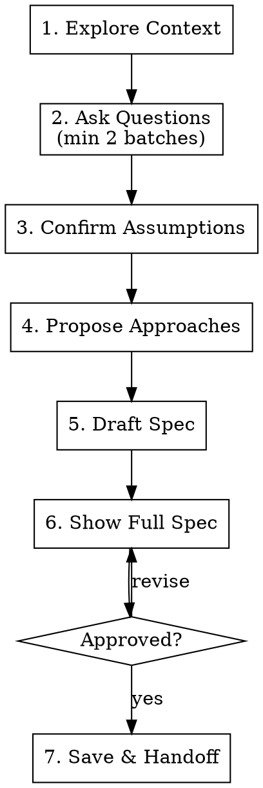

# Plan

Planning skill that produces a thorough spec document with scope boundaries, acceptance criteria, and a parallel-ready task dependency graph. One document — no separate design-to-implementation conversion step.

**Announce at start:** "Using the plan skill to create the spec."

<HARD-GATE>
Do NOT write implementation code, scaffold projects, or invoke any implementation skill until the spec is approved by the user. No exceptions, even for "simple" tasks.
</HARD-GATE>

## Process



## Phase 0: Check for Debug Handoff

If this plan was invoked from the structured-debug skill, a **Debug Handoff Context** block will be present. It contains root cause analysis, fix approach, affected files, and prior investigation.

**When a debug handoff exists:**
1. **Skip Phase 1** — context is already provided
2. **Shorten Phase 2** — only ask about fix design decisions, not about understanding the bug. The minimum 2 batches rule is reduced to 1 batch.
3. **Skip Phase 4** — the fix approach is already decided (debug classified it as "one solution")
4. **Pre-fill the spec** — use the handoff's root cause as the Goal, fix approach as the Approach, and affected files as the starting point for the task table
5. Proceed with Phase 3 (Confirm Assumptions) and Phase 5 (Draft Spec) normally

## Phase 1: Explore Context

Before asking a single question, build a mental model:

- Check memory from mem0 for simiar ideas and solutions
- Use haiku as your explore agent.
- Read relevant source files, configs, and existing docs
- Check recent git history for related changes
- Identify existing patterns, conventions, and constraints

Do NOT ask questions you can answer by reading the codebase.

## Phase 2: Ask Questions (Minimum 2 Batches)

Use AskUserQuestion to ask in batches. Group related questions together (1-4 per batch). Split unrelated questions into separate batches.

**Rules:**
- **Minimum 2 batches required.** If the first batch answers everything, the second batch MUST probe edge cases, error states, and non-functional requirements.
- Usually 4 question per batch and 3 batches total is sufficient, but use your judgment. Complex features may require more batches.
- Prefer multiple-choice options when possible
- Keep going until the spec is clear — no upper limit on rounds
- Never ask what you already know from Phase 1
- Front-load the most important questions

### Domain Checklist

Walk through each domain below. If there is ANY ambiguity, ask about it. Skip only domains that are genuinely irrelevant to the task.

| Domain | What to probe | Example questions |
|---|---|---|
| **Scope** | What's included, what's explicitly excluded | "Should this also handle [adjacent case]?" / "Is [related feature] in or out of scope?" |
| **User experience** | Flows, empty states, loading states, error displays | "What should the user see when [error/empty/loading]?" / "Is there a specific flow or is it flexible?" |
| **Data** | Sources of truth, schemas, migrations, state shape | "Where does this data come from?" / "Do we need to migrate existing data?" / "What's the shape of this entity?" |
| **Integration** | APIs, services, third-party systems | "Does this need to talk to [existing system]?" / "What's the contract with [external API]?" / "Any rate limits or quotas?" |
| **Error states** | Failure modes, recovery, degraded behavior | "What happens if [network fails / input is invalid / service is down]?" / "Should we retry or fail fast?" |
| **Performance** | Data volume, latency budgets, caching | "How much data are we talking about?" / "Is there a latency budget?" / "Do we need pagination?" |
| **Security** | Auth, authorization, input validation, secrets | "Who can access this?" / "Is there auth/authz involved?" / "Any sensitive data that needs encryption?" |
| **Backwards compatibility** | Breaking changes, migration paths, deprecation | "Does this replace something existing?" / "Can we break the current API/behavior?" / "Do old clients need to keep working?" |

**Example — good batching (related questions grouped):**

```
Batch 1 (scope & UX):
  Q1: "What should this feature cover?" [options: A, B, C]
  Q2: "Any existing functionality to preserve?" [options: yes/no]
  Q3: "What should the user see on error?" [options: toast, inline, redirect]

Batch 2 (data & integration):
  Q1: "Where does this data come from?" [options: DB, external API, user input]
  Q2: "Do we need to migrate existing data?" [options: yes, no, not applicable]

Batch 3 (edge cases & non-functional — required if prior batches seem complete):
  Q1: "What happens if the service is unreachable?" [options: retry, fail with message, queue for later]
  Q2: "Expected data volume?" [options: <100 records, 100-10K, 10K+]
```

**Example — bad batching (unrelated questions crammed together):**

```
Batch 1:
  Q1: "What auth strategy?" — technical
  Q2: "What's the project deadline?" — scope
  Q3: "Should we add analytics?" — feature
  Q4: "Which database?" — technical
```

## Phase 3: Confirm Assumptions

Before proposing approaches, explicitly list every assumption you're making and present them to the user:

> "Before I propose approaches, here are assumptions I'm making based on what I've learned. Please confirm or correct any of these:"

Use AskUserQuestion with a multi-select list of assumptions. Each option should be an assumption with a "Correct" / "Wrong" framing. For example:

```
Q1: "Which of these assumptions are WRONG? (select any that need correction)"
  [multiSelect: true]
  - "Auth will use the existing session system"
  - "We're adding new DB tables, not extending existing ones"
  - "This only needs to work on desktop browsers"
  - "No real-time updates needed — standard request/response is fine"
```

If any assumptions are wrong, ask follow-up questions to correct them before proceeding.

## Phase 4: Propose Approaches

Present 2-3 approaches with tradeoffs. Use AskUserQuestion to let the user pick.

**Rules:**
- Each approach must be meaningfully different (not just naming variations)
- Include tradeoffs: complexity, performance, maintainability, time to implement
- Recommend one approach and explain why

**Format:**

```
Q1: "Which approach should we take?"
  - "Approach A: [name] (Recommended)" — [1-2 sentence tradeoff summary]
  - "Approach B: [name]" — [1-2 sentence tradeoff summary]
  - "Approach C: [name]" — [1-2 sentence tradeoff summary]
```

**Example:**

```
Q1: "Which approach for real-time notifications?"
  - "WebSockets (Recommended)" — "Lowest latency, bidirectional. More complex server setup but best UX."
  - "Server-Sent Events" — "Simpler than WebSockets, one-directional. Good enough if we only push from server."
  - "Polling (every 5s)" — "Simplest to implement. Higher server load, 0-5s delay on updates."
```

**When to skip:** If there is genuinely only one reasonable approach (e.g., "add a column to an existing table"), state the approach and why alternatives don't apply, then move on. Do not fabricate fake alternatives.

## Phase 5: Draft Spec

Generate the full spec document using this template. Include all sections that are relevant — skip sections marked "(if applicable)" only when they genuinely don't apply.

````markdown
# [Feature Name] Plan

**Goal:** [One sentence — what we're building and why.]

**Approach:** [2-3 sentences — high-level strategy. Reference the chosen approach from Phase 4.]

## Scope

- **In scope:**
  - [Specific deliverable or behavior]
  - [Another deliverable]
- **Out of scope:**
  - [Explicitly excluded item — and why]
  - [Another excluded item]

## Decisions

- [Decision]: [Choice made] — [Why]
- [Decision]: [Choice made] — [Why]

## Acceptance Criteria

- [ ] [Specific, testable criterion — e.g., "User can submit the form and sees a success toast"]
- [ ] [Another criterion — e.g., "API returns 422 with field-level errors for invalid input"]
- [ ] [Another criterion — e.g., "Page loads in under 2s with 1000 records"]

## Data Model (if applicable)

[Schema definitions, TypeScript types/interfaces, state shapes, or entity descriptions. Enough detail for the implementer to create the exact structure.]

```typescript
// Example:
interface Order {
  id: string;
  userId: string;
  items: OrderItem[];
  status: 'draft' | 'submitted' | 'fulfilled';
  createdAt: Date;
}
```

## API Contracts (if applicable)

[Endpoint definitions with method, path, request body, response shape, and error responses.]

```
POST /api/orders
  Request:  { items: OrderItem[], shippingAddress: Address }
  Response: { order: Order }
  Errors:   422 { errors: { field: string, message: string }[] }
            401 { error: "Unauthorized" }
```

## Error Handling

[How the system behaves when things go wrong. Cover the failure modes identified in Phase 2.]

- **[Failure mode]:** [What happens — e.g., "Show inline error, preserve form state, allow retry"]
- **[Failure mode]:** [What happens — e.g., "Log error, return 500 with generic message, alert in monitoring"]

## Testing Strategy

**Levels:** [Which levels apply — Unit, Integration, E2E]

| ID  | Test Case                      | Type        | Expected Behavior                  |
|-----|--------------------------------|-------------|------------------------------------|
| TC1 | [Describe the scenario]        | Unit        | [Expected outcome]                 |
| TC2 | [Describe the scenario]        | Integration | [Expected outcome]                 |
| TC3 | [Edge case / error scenario]   | Unit        | [Expected outcome]                 |

**Test data:** [How to set up test data — factories, fixtures, mocks, etc.]
**Run command:** [e.g., `npm test`, `pytest`, etc.]

## Tasks

| ID | Task | Blocked By | Risk | Files | Description |
|----|------|------------|------|-------|-------------|
| T1 | ... | — | high | `path/to/file` | ... |
| T2 | ... | T1 | low | `path/to/file` | ... |
| T3 | ... | — | med | `path/to/file` | ... |
| T4 | ... | T2, T3 | low | `path/to/file` | ... |

## Notes for Implementer

- [Edge cases, gotchas, constraints]
- [Non-obvious things the executor must know]
- [Rollback plan if something goes wrong]
````

### Testing Strategy Guidelines

Use your judgment to decide how detailed the test cases should be. Consider:

- **Complex logic** (auth, payments, state machines, data transformations) → detailed test cases covering happy path, error paths, and edge cases
- **CRUD / simple wiring** (add a column, pass data through) → fewer test cases, focus on integration points
- **Security-sensitive features** → always include adversarial test cases (injection, unauthorized access, etc.)

**What makes a good test case table:**

1. **Cover the happy path first** — the basic "it works" scenarios
2. **Then error paths** — invalid input, missing data, unauthorized access
3. **Then edge cases** — empty lists, max values, concurrent access, Unicode
4. **Each test case maps to acceptance criteria** — if an AC isn't covered by at least one test case, add one
5. **Expected behavior is specific** — "Returns 401" not "Fails appropriately"

**Example — auth feature:**

```
| ID  | Test Case                        | Type        | Expected Behavior                    |
|-----|----------------------------------|-------------|--------------------------------------|
| TC1 | Valid login with correct creds    | Integration | Returns 200 + session token          |
| TC2 | Login with wrong password         | Unit        | Returns 401, no token issued         |
| TC3 | Login with non-existent email     | Unit        | Returns 401, same error as TC2       |
| TC4 | Expired session token refresh     | Integration | Returns 401, forces re-login         |
| TC5 | SQL injection in email field      | Unit        | Input sanitized, returns 422         |
| TC6 | Login with empty password          | Unit        | Returns 422 with validation error    |
| TC7 | Concurrent sessions same user     | Integration | Both sessions valid                  |
```

**Example — simple CRUD feature (fewer cases needed):**

```
| ID  | Test Case                        | Type        | Expected Behavior                    |
|-----|----------------------------------|-------------|--------------------------------------|
| TC1 | Create item with valid data       | Integration | Returns 201 + item                   |
| TC2 | Create item missing required field| Unit        | Returns 422 with field error         |
| TC3 | List items with pagination        | Integration | Returns page of items + total count  |
```

### Task Table Rules

These rules are non-negotiable:

1. **Every task MUST have a "Blocked By" value.** Use `—` for tasks with no blockers.
2. **Every task MUST list files it touches.** This prevents merge conflicts when parallel sub-agents work simultaneously.
3. **Two tasks that modify the same file MUST have a dependency.** Either one blocks the other, or both are blocked by a common ancestor. Parallel agents cannot safely edit the same file.
4. **Descriptions are for the implementer, not the reader.** Write enough that a sub-agent with zero context can execute the task. Include what to do, not why. Reference the Data Model and API Contracts sections for exact types and shapes.
5. **No implicit ordering.** If T3 must run after T2, T3 must list T2 in "Blocked By". Row order in the table means nothing.
6. **Tasks must reference acceptance criteria.** Each task description should note which acceptance criteria it satisfies (e.g., "Satisfies AC 1 and 3").
7. **Every task MUST have a Risk level** (`high`, `med`, or `low`). The execute skill uses this to decide agent model and review depth.

### Risk Levels

| Level | When to use | Execute behavior |
|---|---|---|
| **high** | Auth, payments, data migrations, security-sensitive code, shared state, complex business logic | Opus agent + thorough review |
| **med** | New features with moderate logic, API endpoints, state management | Opus agent + standard review |
| **low** | Tests, simple CRUD, config, renaming, straightforward wiring | Sonnet agent + standard review |

**Example — correct dependency graph:**

```
T1: Create DB schema         | —      | high | src/db/schema.ts
T2: Build API routes          | T1     | med  | src/api/routes.ts
T3: Add frontend form         | —      | low  | src/components/Form.tsx
T4: Wire form to API          | T2, T3 | med  | src/components/Form.tsx, src/api/client.ts
T5: Unit tests for API        | T2     | low  | tests/api/routes.test.ts
T6: Unit tests for form       | T3     | low  | tests/components/Form.test.ts
```

Here T1 and T3 can run in parallel (no blockers). T2 waits for T1. T5 and T6 can run in parallel once their blockers resolve. T4 waits for both T2 and T3. T1 is high risk (schema = data integrity), T5/T6 are low risk (tests), T2/T4 are med (API logic).

**Example — wrong (implicit ordering, missing file conflicts):**

```
T1: Create DB schema         | —  | high | src/db/schema.ts
T2: Build API routes          | T1 | med  | src/api/routes.ts
T3: Add frontend form         | —  | low  | src/components/Form.tsx
T4: Wire form to API          | T3 | low  | src/components/Form.tsx     ← WRONG: also depends on T2
T5: Write all tests           | —  |      | tests/                      ← WRONG: too vague, depends on T2+T3, missing risk
```

## Phase 6: Show Full Spec to User

Present the entire spec in one message. Then ask:

> "Approve this spec, or tell me what to change."

If the user requests changes:
1. Apply the changes
2. Re-show the full updated spec
3. Ask for approval again

Loop until approved. Do not proceed without explicit approval.

## Phase 7: Save & Handoff

1. Save the approved spec to `docs/plans/YYYY-MM-DD-<topic>.md`
2. Auto-invoke the execute skill

## Phase 8: Learning

After the plan is saved, assess whether the planning process surfaced knowledge worth saving.

**Ask yourself:** "If I planned another feature for this project next week, what would I wish I already knew?"

**Worth saving:**
- Domain knowledge uncovered during questions (e.g., "Orders can be in 'draft' state indefinitely — don't assume they progress linearly")
- Architectural constraints (e.g., "The frontend can't call the DB directly — everything goes through the API layer, no exceptions")
- User preferences revealed during planning (e.g., "User prefers SSE over WebSockets for real-time features")
- Scope patterns (e.g., "This project scopes features tightly — user consistently excludes admin UI from initial implementation")

**Not worth saving:**
- The plan itself (it's saved as a file)
- Decisions specific to this feature (those are in the plan's Decisions section)
- Things already in the project's CLAUDE.md or README

**How to save:**

1. Check if a relevant memory file already exists:
   ```
   Grep pattern="<relevant keyword>" path=".claude/memory/" glob="*.md"
   ```

2. If a relevant file exists, append to it. If not, create a new one:
   - File: `.claude/memory/<topic>.md` (e.g., `domain-knowledge.md`, `architecture.md`, `user-preferences.md`)
   - Format:

   ```markdown
   ## [Short title]
   **Date:** YYYY-MM-DD
   **Context:** [Which planning session surfaced this]
   **Learning:** [What to remember for next time]
   ```

3. Add a navigation entry to the project's `CLAUDE.md` (only if the memory file is new):
   ```markdown
   ## Memory
   - [Domain knowledge](.claude/memory/domain-knowledge.md)
   ```
   If a `## Memory` section already exists, add the link there. Don't duplicate existing links.

**Do not ask the user for permission.** Use your judgment. If in doubt, save it.

### Mem0 Persistence

After saving any local memory files, invoke the `/save` skill to persist important learnings to mem0 and audit any per-prompt memories from this session.

## Red Flags — You Are Doing It Wrong

| What you're doing | What you should do |
|---|---|
| Writing code during planning | Stop. Code comes after approval. |
| Asking only 1 batch of questions | Minimum 2 batches. Second batch covers edge cases and non-functional requirements. |
| Skipping the domain checklist | Walk through every domain. Skip only if genuinely irrelevant. |
| Not confirming assumptions | List assumptions explicitly and ask the user to verify before drafting. |
| Jumping to one approach without alternatives | Present 2-3 approaches with tradeoffs. Let the user choose. |
| Spec has no acceptance criteria | Every spec needs testable criteria. "It works" is not a criterion. |
| Spec has no scope boundaries | Explicitly list what's in AND out of scope. |
| Putting tasks in order without "Blocked By" | Row order is meaningless. Declare dependencies. |
| Two tasks edit the same file with no dependency | Add a blocking relationship or merge the tasks. |
| Task description says "implement the feature" | Be specific: what to create, what to call, what it returns, which acceptance criteria it covers. |
| Showing spec section-by-section | Show the full spec at once. |
| Creating a separate implementation plan doc | The spec IS the plan. One document. |
| Skipping error handling section | Always define what happens on failure. |
| Testing Strategy has no specific test cases | List concrete scenarios with expected behavior, not just "unit test the validation." |
| Acceptance criteria not covered by test cases | Every AC needs at least one test case. If it's not tested, it's not verified. |
