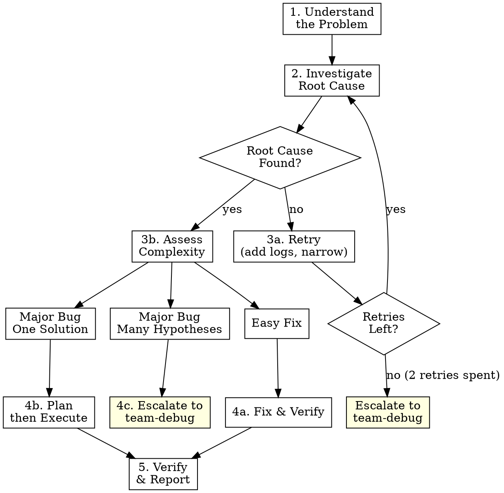

# Structured Debug

Structured debugging with adaptive escalation. Starts simple, escalates only when needed.

**Announce at start:** "Using the structured-debug skill to investigate this."

<HARD-GATE>
1. NEVER propose a fix before identifying the root cause. Symptom-level fixes waste time.
2. NEVER skip reproducing the bug. If you can't reproduce it, you can't verify the fix.
3. NEVER stack multiple fixes at once. One change, one test. Always.
4. ALWAYS use Opus for debug work. Bugs are tricky — even "easy" fixes can have subtle edge cases. When dispatching sub-agents for debug fixes, always use `model: "opus"`.
</HARD-GATE>

## Process Overview



## Phase 1: Understand the Problem

Before touching any code, get a clear picture of the bug.

### 1a. Gather Information

Use AskUserQuestion to clarify anything unclear. You need ALL of:

| Info | Why | Example question |
|---|---|---|
| **Expected behavior** | Defines "correct" | "What should happen when you click submit?" |
| **Actual behavior** | Defines the symptom | "What happens instead?" |
| **Reproduction steps** | Makes it testable | "What exact steps trigger this?" |
| **When it started** | Narrows the change set | "Did this work before? What changed?" |
| **Error output** | Direct evidence | "Any error messages, stack traces, or logs?" |
| **Environment** | Rules out env issues | "Which browser/OS/Node version?" |

**Rules:**
- If the user provides a clear error message + repro steps, you may not need to ask anything — proceed.
- If the user says "it's broken" with no details, ask. Don't guess.
- Batch related questions together (1-4 per batch, same as the plan skill).

### 1b. Reproduce the Bug

Before investigating code, confirm you can reproduce the issue:

- Run the failing test, command, or flow
- If you can't reproduce, ask the user for more details — do NOT proceed to investigation on a bug you can't see
- Record the exact error output for later comparison

### 1c. Confirm Understanding

Summarize back to the user:

> "Here's my understanding: [expected behavior] but instead [actual behavior] when [steps]. The error is [error]. Is this correct?"

Do NOT proceed until the user confirms.

## Phase 2: Investigate Root Cause

Systematic investigation, not guessing.

### 2a. Classify the Bug Type

Based on what you learned in Phase 1, identify the bug type:

| Type | Signals | Go to |
|---|---|---|
| **Crash / Error** | Stack trace, error message, exception, test failure | Section 2B-crash |
| **Performance** | "It's slow", high latency, timeouts, UI freezes | Section 2B-perf |
| **Race condition** | "Works sometimes", "flaky test", timing-dependent | Section 2B-race |
| **Memory leak** | Gradual slowdown, OOM after sustained use, growing heap | Section 2B-memory |
| **Silent wrong result** | No error but output is incorrect — wrong total, missing data, bad state | Section 2B-silent |
| **UI / Visual** | Layout broken, wrong styling, rendering glitch — no JS error | Section 2B-visual |

If unclear, start with **Crash / Error** techniques and reclassify if they don't apply.

---

### 2B-crash: Crash / Error Investigation

The standard path — there's an error with a stack trace.

**Step 1: Read the Error**
- Read the full error message and stack trace (not just the first line)
- Identify the exact file, function, and line where the error originates
- Check if it's a direct error (the code at that line is wrong) or a downstream error (bad data passed from elsewhere)

**Step 2: Trace the Execution Path**
- From the error point, trace backward: what function called this? What called that?
- What data was passed at each step? Where does the data first become wrong?
- Read the actual source files. Do not guess based on function names.

**Step 3: Check Recent Changes**

If the user said "it was working before":

*Quick check first:*
- Check `git log` and `git diff` for recent changes to the affected files
- If there are only a few recent commits, read the diffs — often the bug is in the most recent commit

*Use `git bisect` when:*
- There are many commits since it last worked (10+), OR
- The quick check didn't reveal the culprit, OR
- The user knows a specific commit/date when it was working

```bash
# Start bisect
git bisect start
git bisect bad                    # current commit is broken
git bisect good <known-good>     # commit or tag where it worked

# At each step, reproduce the bug:
#   If broken → git bisect bad
#   If working → git bisect good
# Git narrows to the exact commit that introduced the bug.

git bisect reset                  # when done, return to original branch
```

If you can reproduce the bug with a command (test, script, curl), automate bisect:
```bash
git bisect start HEAD <known-good>
git bisect run <command-that-exits-0-on-success>
```

Once bisect identifies the commit, read its diff — the root cause is in that change.

**Step 4: Compare with Working Examples**
- Find similar code in the codebase that works
- How does a working version of this pattern look?
- What's different between the working and broken code?
- Don't skim — compare carefully, line by line

→ Then go to **2C: Form a Hypothesis**

---

### 2B-perf: Performance Investigation

No error — the system is just slow.

**Step 1: Measure, Don't Guess**
- Identify WHAT is slow: API response? Page load? DB query? Render?
- Measure the actual time. Get a baseline number before investigating.
- Use the tools available in the project:
  - **Backend:** Add timing logs (`console.time`/`performance.now`), check slow query logs, use profiling tools
  - **Frontend:** Browser DevTools Performance tab, Lighthouse, Network waterfall
  - **DB:** `EXPLAIN ANALYZE` on suspect queries

**Step 2: Narrow the Bottleneck**
- If an API is slow: is it the DB query, business logic, serialization, or network?
- Add timing at each stage of the pipeline to isolate the slow segment
- Look for: N+1 queries, missing indexes, unnecessary data fetching, synchronous I/O, large payloads

**Step 3: Check Data Volume**
- Does it work fast with small data but slow with production-size data?
- Look for O(n²) loops, unbounded queries (`SELECT *` without `LIMIT`), in-memory sorting of large datasets

**Step 4: Check for Regressions**
- If it was fast before: use `git bisect` with a performance threshold as the pass/fail criterion

→ Then go to **2C: Form a Hypothesis**

---

### 2B-race: Race Condition Investigation

Non-deterministic — works sometimes, fails sometimes.

**Step 1: Identify the Competing Actors**
- What operations are running concurrently? (parallel requests, async operations, timers, event handlers)
- Which shared state could they both be reading/writing?

**Step 2: Look for Timing Dependencies**
- Does adding a `sleep`/delay make the bug appear or disappear? (Classic sign of a race)
- Does the bug happen more under load or on slower machines?
- Check for missing `await`, fire-and-forget promises, or `setTimeout` used as synchronization

**Step 3: Make It Deterministic**
- Try to reproduce reliably by removing concurrency: serialize the operations and see if the bug disappears
- If it disappears when serialized → the race is confirmed, and the shared state is the root cause
- Add logging with timestamps to see the actual execution order

**Step 4: Check for Missing Synchronization**
- Missing locks, missing transactions, stale reads, optimistic concurrency without retry
- In frontend: state updates that don't account for unmounted components or stale closures

→ Then go to **2C: Form a Hypothesis**

---

### 2B-memory: Memory Leak Investigation

Gradual degradation — works initially, degrades over time.

**Step 1: Confirm the Leak**
- Monitor memory usage over time (Node: `process.memoryUsage()`, browser: DevTools Memory tab)
- Does memory grow steadily with repeated operations? Or does it plateau? (Plateau = not a leak, just high usage)

**Step 2: Identify What's Growing**
- Take heap snapshots at intervals and compare: what objects are accumulating?
- Look for: growing arrays/maps, event listeners never removed, subscriptions never unsubscribed, cached data never evicted, closures holding references to large objects

**Step 3: Common Culprits**
- Event listeners added in a loop or on mount without cleanup on unmount
- `setInterval` without corresponding `clearInterval`
- Global caches/maps that grow without bounds (no TTL or size limit)
- Closures capturing outer scope variables that keep large objects alive

→ Then go to **2C: Form a Hypothesis**

---

### 2B-silent: Silent Wrong Result Investigation

No error, but the output is incorrect.

**Step 1: Define "Correct"**
- What should the output be? Get a concrete expected value, not just "it's wrong."
- If possible, compute the correct answer manually or find a known-good case to compare against.

**Step 2: Trace the Data**
- Add logging at each transformation step: input → transform 1 → transform 2 → output
- Find the FIRST point where the data diverges from expected
- Common culprits: off-by-one, wrong variable name (similar names), integer vs float division, timezone issues, incorrect sort/filter predicate, stale cached value

**Step 3: Test with Edge Cases**
- Does it work with simple inputs but fail with edge cases? (Empty array, null, zero, negative, Unicode, very large numbers)
- Does it work for one item but fail for many? (Aggregation bugs)

**Step 4: Compare with Specification**
- Read the requirements/spec. Is the code implementing the wrong formula, wrong business rule, or wrong algorithm?

→ Then go to **2C: Form a Hypothesis**

---

### 2B-visual: UI / Visual Bug Investigation

No JS error — layout, styling, or rendering is wrong.

**Step 1: Isolate the Component**
- Which component renders the broken UI?
- Does the issue happen in isolation (storybook, standalone), or only in the full page context?

**Step 2: Inspect with DevTools**
- Use browser DevTools Elements panel: check computed styles, box model, layout
- Look for: CSS specificity conflicts, inherited styles, z-index stacking issues, flex/grid misconfiguration, overflow hidden clipping

**Step 3: Check Responsive / Cross-Browser**
- Does it break only at certain viewport sizes? Check media queries and container queries.
- Does it break only in certain browsers? Check for unsupported CSS properties.

**Step 4: Check Dynamic Rendering**
- Is the data that drives the UI correct? (Check with React DevTools / Vue DevTools)
- Is the component re-rendering unexpectedly? (Stale props, missing keys, wrong conditional rendering)

→ Then go to **2C: Form a Hypothesis**

---

### 2C. Form a Hypothesis

Regardless of bug type, state a single, specific hypothesis:

> "I believe the root cause is [X] because [evidence Y]. Specifically, in `file.ts:42`, the function [does Z] when it should [do W]."

A good hypothesis includes:
- **Where**: exact file and line (or component/query for non-code bugs)
- **What**: what the code does wrong
- **Why**: what it should do instead
- **Evidence**: how you know this (not "I think" — point to code, logs, measurements, or profiling data)

## Decision Point: Root Cause Found?

### YES → Go to Phase 3 (Assess Complexity)

### NO → Phase 2R: Retry (max 2 retries)

If investigation didn't find a clear root cause:

**Retry 1: Add Instrumentation**
1. Add targeted logging or `console.log` at key points in the execution path
2. Focus on data boundaries — what goes in and comes out of each function
3. Reproduce the bug and read the new output
4. Return to Phase 2 with the new evidence

**Retry 2: Narrow the Scope**
1. Ask the user follow-up questions based on what you've learned:
   - "I've narrowed it to [area]. Does [specific scenario] also fail?"
   - "Can you try [variation] and tell me if the same error occurs?"
2. Try a different investigation angle — if you traced forward, trace backward. If you read code, run it instead.
3. Return to Phase 2

**After 2 retries with no root cause → ESCALATE**

> "I've investigated this from [N] angles and can't isolate the root cause. Escalating to team-debug for parallel independent investigation."

Invoke the `team-debug` skill. Pass it everything you've learned:
- Bug summary from Phase 1
- All investigation findings (what you checked, what you ruled out)
- Instrumentation output
- Your best hypotheses (even if unconfirmed)

**STOP here.** Team-debug takes over.

## Phase 3: Assess Complexity

You found the root cause. Now decide the fix approach:

### Classification

Ask yourself these questions:

| Question | If YES → |
|---|---|
| Is the fix a single, obvious change (wrong value, missing null check, typo, off-by-one)? | **Easy fix** |
| Is the fix clear but touches multiple files, needs new code, or requires careful sequencing? | **Major bug — one solution** |
| Are there multiple plausible fixes and you're not sure which is best? Or does the root cause span multiple systems? | **Major bug — many hypotheses** |

### Easy Fix → Phase 4a

Criteria:
- You can describe the fix in one sentence
- It touches 1-3 lines of code
- There's no architectural decision to make
- The fix is obviously correct (not "it might work")

### Major Bug, One Solution → Phase 4b

Criteria:
- The root cause is clear and confirmed
- There's one right way to fix it
- But the fix is non-trivial: multiple files, new code, careful ordering
- Benefits from a structured plan

### Major Bug, Many Hypotheses → Phase 4c

Criteria:
- The root cause might have multiple valid fixes with different tradeoffs
- OR the root cause itself is clear but the fix approach is debatable
- OR the bug spans multiple systems and needs parallel investigation
- Benefits from independent parallel attempts

**Present your assessment to the user:**

> "Root cause: [X]. I'd classify this as [easy fix / major-one / major-many] because [reason]. Agree, or should I take a different approach?"

Wait for confirmation.

## Phase 4a: Easy Fix

For simple, obvious fixes:

1. **Fix it.** Make the minimal change. Don't refactor surrounding code.
2. **Test it.** Run existing tests or reproduce the original bug to confirm it's gone.
3. Go to Phase 5.

## Phase 4b: Major Bug — Plan then Execute

For complex fixes with a clear solution:

> "This needs a structured fix. Invoking the plan skill to design the solution."

**Invoke the plan skill with a structured handoff.** Before invoking, prepare the following context block and present it at the start of the plan session so the plan skill can skip redundant investigation:

```
## Debug Handoff Context

**Bug:** [1-sentence summary of the bug]
**Root cause:** [Where (file:line) and why it happens]
**Evidence:** [How you confirmed — stack trace, logs, bisect result, etc.]

**Fix approach:** [What needs to change at a high level]
**Affected files:**
- `path/to/file1` — [what needs to change here]
- `path/to/file2` — [what needs to change here]

**Already investigated:**
- [What you checked and ruled out]
- [Working examples you compared against]

**Risks:**
- [Potential side effects of the fix]
- [Things the plan should account for]
```

The plan skill should:
1. **Skip Phase 1 (Explore Context)** — the debug handoff already provides the context
2. **Skip or shorten Phase 2 (Questions)** — only ask questions about the fix design, not about understanding the bug
3. **Use Phase 3 (Confirm Assumptions)** normally — confirm the fix approach assumptions
4. **Skip Phase 4 (Propose Approaches)** — the fix approach is already decided (that's why this is "one solution", not "many hypotheses")
5. Proceed with spec drafting as normal

After the plan is approved, the execute skill will implement it.
After execution completes, go to Phase 5.

## Phase 4c: Major Bug — Escalate to Team Debug

For bugs with competing hypotheses or multi-system root causes:

> "This bug has multiple possible fixes. Escalating to team-debug for parallel investigation of competing approaches."

Invoke the `team-debug` skill. Pass it:
- Bug summary from Phase 1
- Root cause analysis from Phase 2
- The competing hypotheses or approaches
- All evidence gathered

**STOP here.** Team-debug takes over.

## Phase 5: Verify & Report

After the fix is applied (from 4a or 4b):

### 5a. Verify

1. **Reproduce the original bug** — confirm it no longer occurs
2. **Run the test suite** — confirm no regressions
3. If tests fail or bug persists:
   - Do NOT mark as fixed
   - Return to Phase 2 with the new information
   - This counts as a retry

### 5b. Clean Up

Remove any diagnostic instrumentation (console.logs, debug flags) added during investigation.

### 5c. Report

Tell the user:

```
## Bug Fix Summary

**Root cause:** [Where and why the bug occurred]
**Fix:** [What was changed]
**Verification:** [Tests passed / manual verification steps]

**Manual steps required (if any):**
- [e.g., Run migrations, restart service, clear cache]
```

Ask the user to confirm the bug is resolved.

## Phase 6: Learning

After the bug is confirmed resolved, assess whether this debugging session produced knowledge worth saving for future sessions.

**Ask yourself:** "If I encountered a similar bug in this project 3 months from now, what would I wish I already knew?"

**Worth saving:**
- Bug patterns specific to this codebase (e.g., "Timezone bugs recur because the DB stores UTC but the API returns local time without converting")
- Non-obvious gotchas (e.g., "The cache layer silently swallows errors — always check cache.get() return value")
- Root causes that were hard to find (e.g., "Event listeners in ComponentX are never cleaned up — check this first for memory leaks")
- Debugging techniques that worked for this stack (e.g., "Use `DEBUG=express:*` to see middleware execution order")

**Not worth saving:**
- Obvious fixes (typo, missing import)
- One-off bugs unlikely to recur
- Things already documented in the project's README or CLAUDE.md

**How to save:**

1. Check if a relevant memory file already exists:
   ```
   Grep pattern="<relevant keyword>" path=".claude/memory/" glob="*.md"
   ```

2. If a relevant file exists, append to it. If not, create a new one:
   - File: `.claude/memory/<topic>.md` (e.g., `debugging-patterns.md`, `auth-gotchas.md`, `db-conventions.md`)
   - Format: one entry per learning, with date and context

   ```markdown
   ## [Short title]
   **Date:** YYYY-MM-DD
   **Bug:** [1-sentence summary]
   **Learning:** [What to remember for next time]
   **Files:** [Relevant files or areas]
   ```

3. Add a navigation entry to the project's `CLAUDE.md` (only if the memory file is new):
   ```markdown
   ## Memory
   - [Debugging patterns](.claude/memory/debugging-patterns.md)
   ```
   If a `## Memory` section already exists, add the link there. Don't duplicate existing links.

**Do not ask the user for permission.** Use your judgment. If in doubt, save it — it's cheap to delete later.

### Mem0 Persistence

After completing the debug session, invoke the `/save` skill to persist important learnings to mem0 and audit any per-prompt memories from this session.

## Red Flags — You Are Doing It Wrong

| What you're doing | What you should do |
|---|---|
| Proposing a fix before finding root cause | Investigate first. Always. |
| "Quick fix for now, we'll clean up later" | Fix it right or escalate. No band-aids. |
| "Just try changing X and see if it works" | Form a hypothesis with evidence first. |
| Stacking multiple changes before testing | One change, one test. Always. |
| Can't reproduce but investigating anyway | Stop. Get reproduction steps. |
| Third retry of root cause investigation | Escalate to team-debug. You're going in circles. |
| Saying "I think" without pointing to code | Evidence-based hypotheses only. Cite file:line. |
| Fixing the symptom instead of the cause | Trace backward to the real source. |
| Refactoring code around the bug | Minimal fix. Don't touch unrelated code. |
| Skipping verification | Always reproduce the original bug after fixing. |
| Major fix without invoking plan skill | Complex fixes need structure. Use plan → execute. |
| Guessing between multiple fix approaches | Multiple hypotheses → team-debug, not coin flip. |
